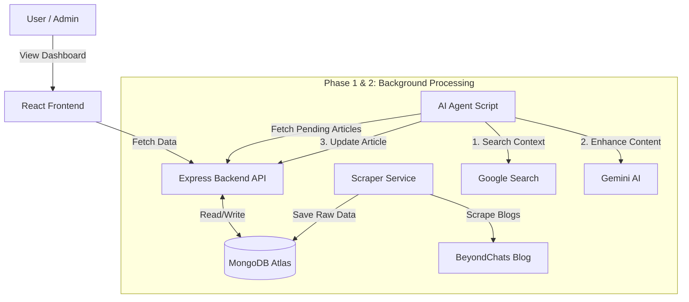

# BeyondChats AI Content Enhancer

A full-stack application designed to scrape blog articles, enhance them using Google Search context and Generative AI (Gemini), and display a comparison between the original and enhanced versions in a professional React UI.

## 🚀 Live Demo
- **Frontend (UI):** https://beyond-chats-assignment-omega.vercel.app/
- **Backend (API):** https://beyondchats-assignment-m7m9.onrender.com

---

## 🏗 Architecture / Data Flow
This project follows a decoupled architecture separating the Scraper, AI Agent, and User Interface.


---

## 🛠 Tech Stack
- **Frontend:** React + Vite, Tailwind CSS, Lucide Icons, React Markdown.
- **Backend:** Node.js, Express.js.
- **Database:** MongoDB Atlas (Cloud).
- **AI & Automation:** Puppeteer (Stealth Scraping), Google Gemini API (Content Generation).

---

## ⚙️ Local Setup Instructions

### Prerequisites
- Node.js installed.
- MongoDB Atlas Connection String.
- Google Gemini API Key.

### 1. Backend Setup
Navigate to the backend folder and install dependencies:
```bash
cd backend
npm install
```
Create a .env file in the backend directory:

Code snippet

PORT=5000
MONGO_URI=your_mongodb_connection_string
GEMINI_API_KEY=your_google_gemini_key
Start the Server:

```bash

npm start
```
### 2. Frontend Setup
Navigate to the frontend folder and install dependencies:

```bash

cd ../beyondchats-frontend
npm install
```
Start the React App:

```bash

npm run dev
```
## 🤖 How to Run the AI Agent
To trigger the scraping and AI enhancement process locally:

Ensure the Backend server is running.

Open a new terminal in the backend folder.

Run the agent script:

```bash
node agent.js
```
This will fetch pending articles, perform Google Searches, and update the database with AI-enhanced content.

## 📂 Project Structure
/backend: Contains Express API, Scraper Logic, and the agent.js script.

/beyondchats-frontend: Contains the React UI logic and components.

## 📝 Approach & Challenges
Scraping Strategy: Implemented a smart pagination scraper that traverses backward from the last page to find the absolute oldest articles to fulfill the assignment requirement.

AI Integration: Used a multi-step agent that first gathers context from Google Search top results (using Puppeteer Stealth to avoid blocks), then feeds that context to Gemini for a factual rewrite.

Deployment: Deployed Backend on Render and Frontend on Vercel for a live demonstration.